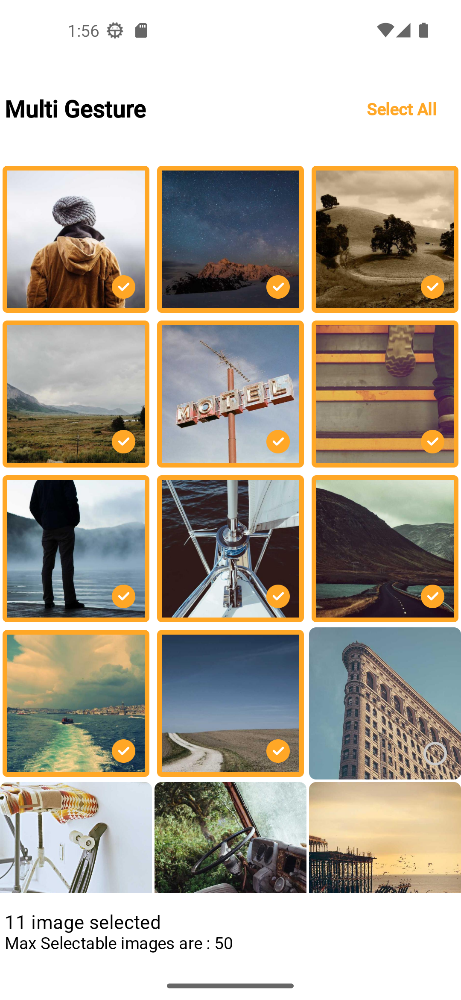

# Photo Grid Multi-Select

This project is a Composable function-based implementation of a photo grid that supports multi-selection through various user gestures such as tap, long press, and drag-to-select. It allows users to interact with a grid of images in a flexible and intuitive way, making it easy to select multiple images at once.

## Features

- **Tap to Select/Deselect**: Tap on an image to select or deselect it.
- **Long Press to Lock**: Long press on an image to lock its selection status, preventing it from being deselected through other gestures.
- **Drag to Select**: Drag across multiple images to select them in a single gesture.

## Video

[](video/multi_gesture.mp4)

## Usage

### `Modifier.dragSelection`

This function extends a Modifier to add drag-based selection capabilities.

```kotlin
@Composable
fun Modifier.dragSelection(
    imageModelList: List<ImageModel>,
    state: LazyGridState,
    imageModelsSelected: List<ImageModel>,
    onSelectionChange: (ImageModel) -> Unit,
    lockedImage: ImageModel? = null
): Modifier
```

- **`imageModelList`**: The list of images to display and select from.
- **`state`**: The state of the LazyGrid used to display the images.
- **`imageModelsSelected`**: The list of images currently selected.
- **`onSelectionChange`**: Callback function invoked when the selection changes.
- **`lockedImage`**: An optional image that cannot be deselected.

### `PhotoGridMultiSelect`

This function displays a grid of images and supports multiple selection using tap, long press, and drag gestures.

```kotlin
@Composable
fun PhotoGridMultiSelect(
    modifier: Modifier = Modifier,
    imageModelList: List<ImageModel>,
    selectedList: List<ImageModel>,
    onImageLongClick: (Int, ImageModel) -> Unit,
    onSelectionChange: (ImageModel) -> Unit,
    lockedImage: ImageModel? = null,
    onLoadMore: () -> Unit = {},
    showLoaderItem: Boolean = false
)
```

- **`modifier`**: Modifier for customizing the appearance and behavior.
- **`imageModelList`**: List of images to display in the grid.
- **`selectedList`**: List of currently selected images.
- **`onImageLongClick`**: Callback function invoked when an image is long-pressed.
- **`onSelectionChange`**: Callback function invoked when the selection changes.
- **`lockedImage`**: An optional image that cannot be deselected.
- **`onLoadMore`**: Callback function invoked to load more images when the end of the grid is reached.
- **`showLoaderItem`**: Boolean flag to show a loader item at the end of the grid.

## Gestures

### Tap Gesture

- **Action**: Tap on an image.
- **Behavior**: Selects the image if it's not selected. Deselects the image if it's already selected.
- **Usage**: Simply tap on any image in the grid to toggle its selection status.

### Long Press Gesture

- **Action**: Long press on an image.
- **Behavior**: Locks the image selection, preventing it from being deselected through other gestures.
- **Usage**: Long press on any image in the grid to lock its selection.

### Drag to Select Gesture

- **Action**: Press and hold on an image, then drag across other images.
- **Behavior**: Selects all images within the dragged area.
- **Usage**: Press and hold on an image to start dragging, then move across other images to select them.

This project leverages the power of Jetpack Compose to create a responsive and user-friendly interface for selecting images. The implementation ensures smooth interactions and provides visual feedback through haptic responses for an enhanced user experience.
